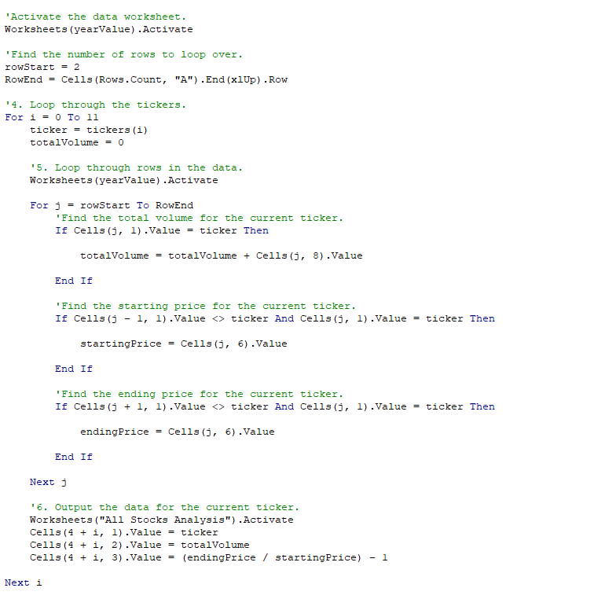
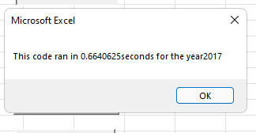
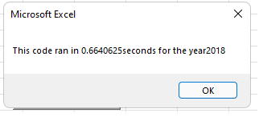
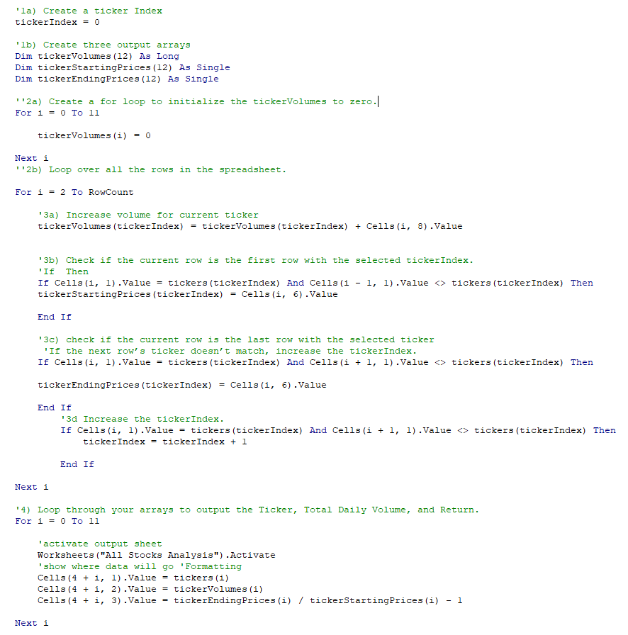
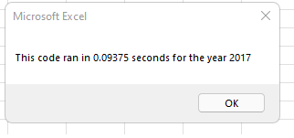
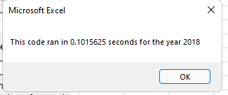

# Stock Analysis - VBA Challenge
## Project Overview
A friend has asked to do analysis on the tickers in the stock market so he could give his parents guidance on selecting which stock they want to invest in. After writing a code to do that, we decided to see if there is a more efficient/quicker way to analyize the stocks in the market. 
## Analysis 
In the original code used to analyze the stocks, two loops were used to comb over the data and output the results. 

The time it took to output the results were pretty quick. 
For 2017 it took .664 seconds:

And for 2018 it took the same amount of time:

The results were really fast, but we were curious to see if it could be done even faster. 

After refactoring the code, we were able to make the macro go through the data one time, instead of two, and output the results faster. In only one loop. 
Shown Below: 

Refactoring the code allowed us to output the date a lot quicker. For the same 2017 data it took .09375 seconds to analyze it, which is a little over 7 times faster than the original code.

And for the 2018 data it took .1016 seconds, which is a little over 6.5 times faster than the original code.

## Summary
What are the advantages or disadvantages of refactoring code?
- Advantages of refactoring code is that it can make the code more efficient. By making it faster, making it easier to understand or removing any restraints the previous code could have had. 
- Disadvantages of refactoring code could be that you have a working code already, and by trying to make it more efficent you could "break it". You should have a very good understanding of both, what the code is already doing and what you want to make it do instead before you attempt to refactor an already working code.

How do these pros and cons apply to refactoring the original VBA script?
- They apply because we were able to refactor the code to make it a lot faster. But it took a lot of time and brain power. I spent a lot of time googling bugs that occured in the process and how to get it to run properly. In the real world the code already worked, maybe not in a tenth of a second, but still in under a second. So it could be argued that becasue it already worked and was efficient, we should have just left it alone. 
